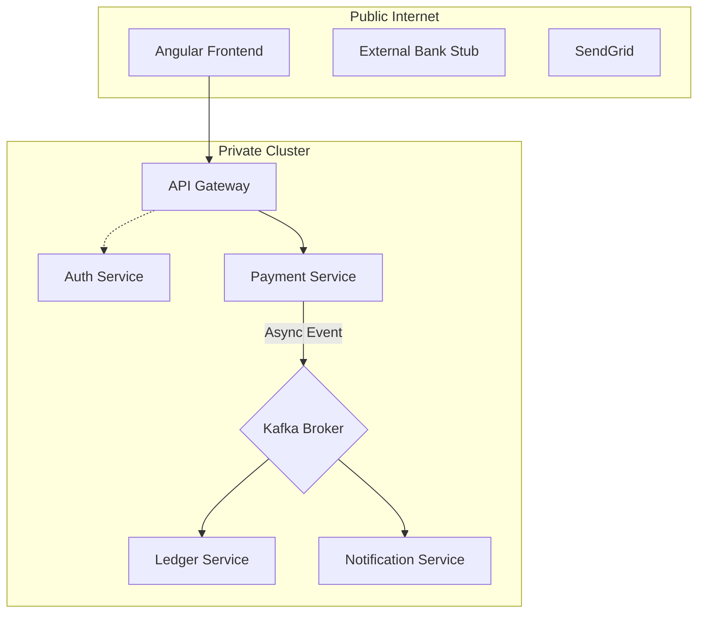
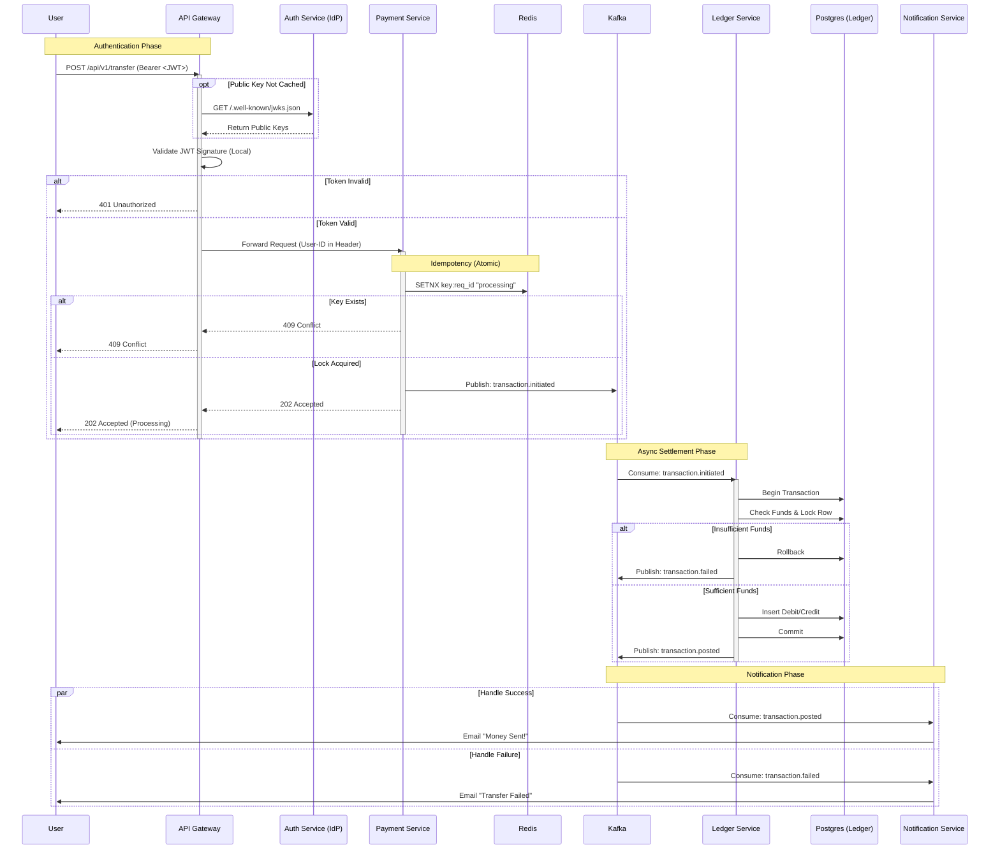
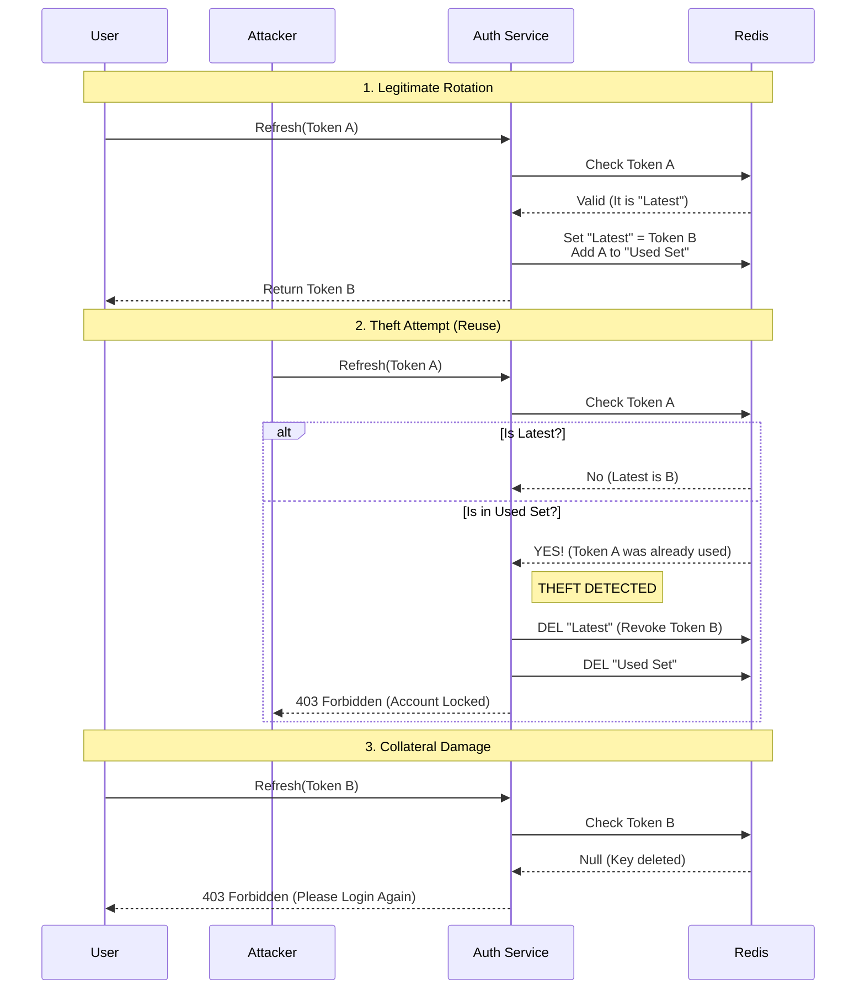
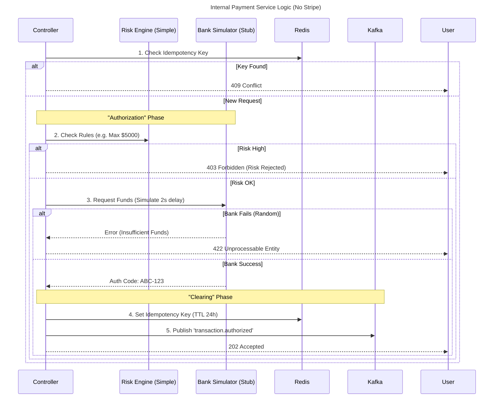
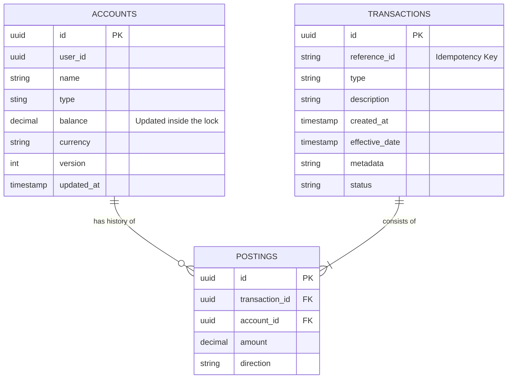
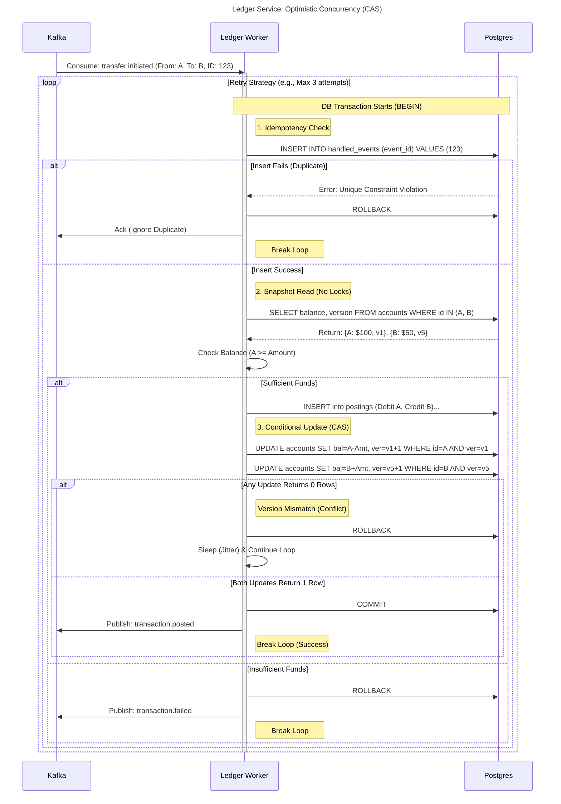
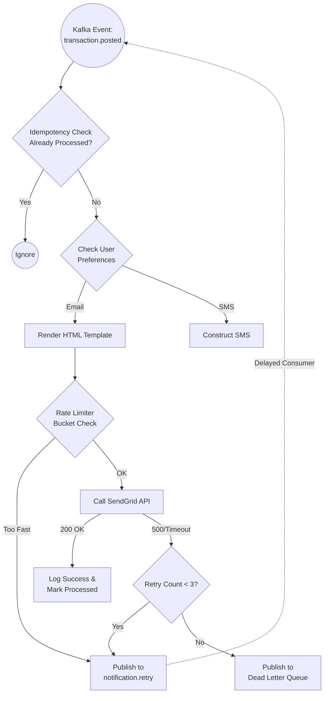
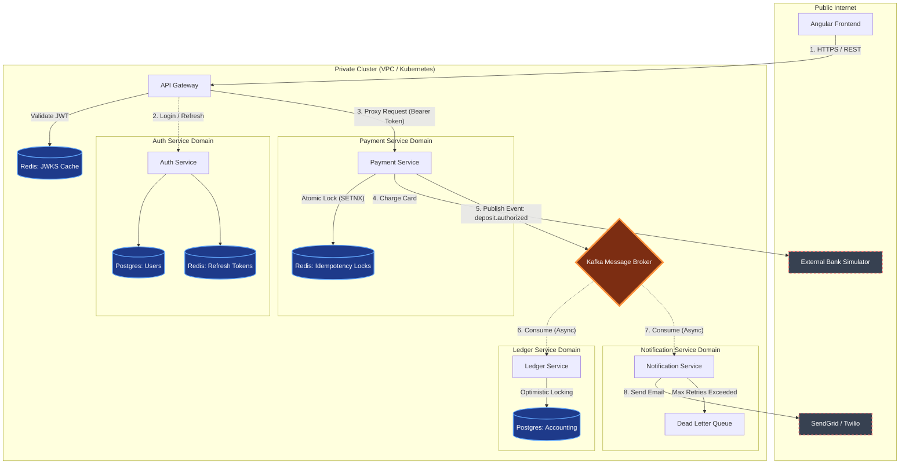

### Distributed Payment & Ledger System

A high-fidelity simulation of a financial payment processing system designed to handle concurrency, idempotency, and distributed consistency.

This project demonstrates how to build a Zero Trust microservices architecture that solves the "Double Spend" problem using Pessimistic Locking and Double-Entry Accounting.

### System Architecture

The system follows an Event-Driven Architecture using Kafka for asynchronous decoupling between the Payment Gateway and the Ledger.

### Key Features & Design Patterns

1. Zero Trust Security & Token Rotation

    Stateless Validation: Services validate JWT signatures locally using cached JWKS public keys to avoid network bottlenecks.

    Theft Detection: Implements Refresh Token Rotation with "Token Family" tracking. If a rotated token is reused, the entire family is revoked, locking out potential attackers.

2. Financial Integrity

    Optimistic Concurrency Control: The Ledger Service uses a versioning mechanism (e.g., version column or eTag) to manage updates. Transactions verify that the record has not been modified by another process since it was read. If a version mismatch occurs, the transaction is rejected and must be retried.

    Conflict Resolution: Instead of physical database locks, the system relies on atomic "Compare-and-Swap" (CAS) operations. This eliminates database-level deadlocks and significantly increases throughput during low-to-medium contention.

    Double-Entry Accounting: Every transaction is recorded as two immutable postings (Debit & Credit) where $\sum \text{Amount} = 0$.

3. Distributed Resiliency

    Idempotency: The Payment Service uses Atomic Redis locks (SETNX) to ensure no request is processed twice, even if the client retries aggressively.

    Non-Blocking Retries: The Notification Service uses a "Retry Topic" and Dead Letter Queue (DLQ) pattern to handle failures without blocking the main consumer group.

### End-to-End Request Flow

This sequence diagram illustrates the lifecycle of a transfer request as it propagates through the system, demonstrating the **Zero Trust** handoff between the Gateway and Services, and the **Event-Driven** settlement phase.

### Microservices Breakdown:

### Authentication Service

Handles identity, JWT issuance, and secure token rotation.

    Pattern: OAuth2 Resource Server / Refresh Token Rotation.

    Store: Redis (for white-listing refresh tokens).

### Payment Service (The Orchestrator)

Handles the "Authorization" phase. It talks to the external world (Bank Simulator) and ensures the request is valid before passing it to the Ledger.

    Pattern: Saga (Orchestration) / Idempotency Key.

    Safety: Uses SETNX in Redis to lock the request ID immediately.

### Ledger Service (The Source of Truth)

The heart of the system. It consumes events and updates balances.

    Pattern: Event Sourcing (Lite) / Pessimistic Locking.

    Schema: Implements a strict Double-Entry schema.

Table	Purpose

ACCOUNTS	Snapshot of current balance (Locked for writes).

TRANSACTIONS	Immutable journal of what happened.

POSTINGS	Immutable record of math (Debit/Credit pairs).

### Notification Service

Listens for transaction.posted or transaction.failed events to alert the user.

    Pattern: Rate Limiting / Dead Letter Queue.

    Tech: Thymeleaf (Template Rendering), SendGrid (Stub).

### Technology Stack

    Core: Java 25, Spring Boot 4.0

    Data: PostgreSQL, Redis

    Messaging: Apache Kafka

    Infrastructure: Docker, Docker Compose

    Testing: JUnit 5, Testcontainers

### How to Run

    Clone the Repo
    Bash

    git clone https://github.com/yourusername/payment-simulation.git
    cd payment-simulation

    Start Infrastructure Spin up Postgres, Redis, Kafka, and Zookeeper.
    Bash

    docker-compose up -d

    Run Services You can run each microservice via Maven or as Docker containers.
    Bash

    ./mvnw spring-boot:run

### Future Improvements

    Implement mTLS with a Service Mesh (Istio) for internal traffic encryption.

    Add Prometheus/Grafana dashboards for real-time monitoring of transaction throughput.

### Master System Architecture

