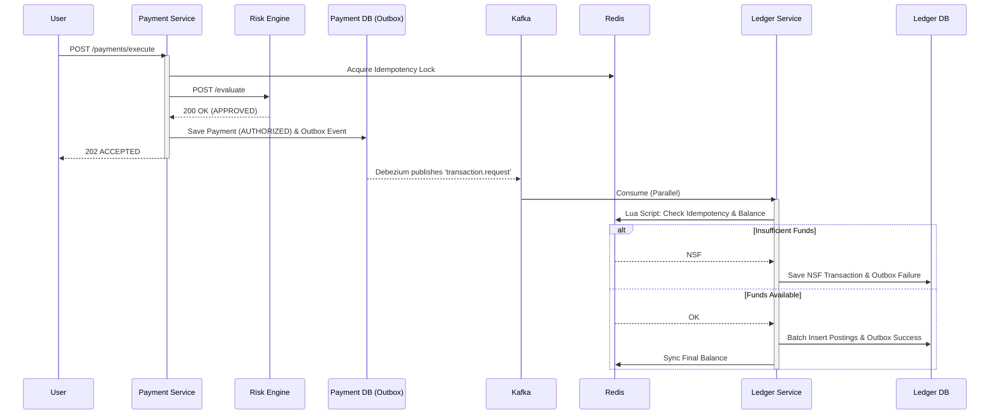
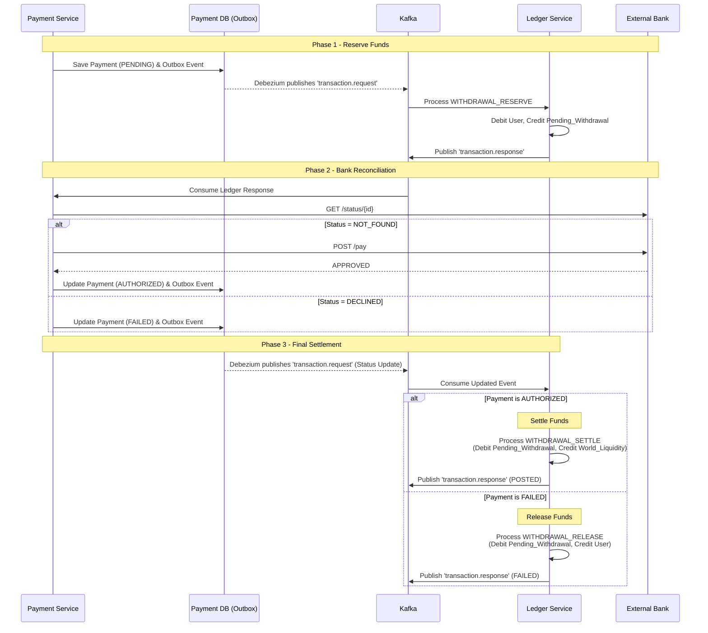

# Distributed Payment & Ledger System

A high-throughput, event-driven payment processing system designed to guarantee consistency, idempotency, and financial
integrity at scale.

# Overview

This project simulates a production-grade financial system capable of handling concurrent transactions while preventing
double spending through:

* **Event-driven microservices**
* **Redis-backed soft-state validation**
* **Transactional Outbox + CDC (Debezium)**
* **Strict double-entry accounting**

It models real-world constraints like:

* **partial failures**
* **distributed consistency**
* **external system orchestration**

## Core Design Principles

* **Consistency over convenience** → Financial correctness is non-negotiable
* **Asynchronous by default** → Decoupled services via Kafka
* **Idempotent everywhere**  → Safe retries under failure
* **Throughput optimized** → Avoid DB bottlenecks with Redis staging

# Architecture


## What Makes This Interesting

* **High-Throughput Ledger Processing**
* **Parallel Kafka consumption** with ordering guarantees
* **Redis Lua scripts** for atomic validation:
    * idempotency
    * balance checks
* **Batch persistence** to Postgres

**Result:** sub-millisecond validation + minimized DB contention

## Strong Consistency in a Distributed System

* **Transactional Outbox Pattern**
    * DB write + event emission = atomic
* **Debezium CDC**
    * WAL-based event publishing
* **No dual writes, no data loss**

## Idempotency (End-to-End)

| Layer  |                Strategy                |
|--------|:--------------------------------------:|
| API    |        Redis ```SETNX``` locks         |
| DB     |           Unique constraints           |
| Ledger | Ledger + ``` ON CONFLICT DO NOTHING``` |

## Self-Healing Recovery

* **Scheduled recovery using:** </br>
    * ```FOR UPDATE SKIP LOCKED```

* **Safely resumes stuck transactions after:**
    * crashes
    * network failures

## Financial Integrity

* **Double-entry accounting**
* Immutable ledger
* Guaranteed invariant: </br>
  ```Σ(amount) = 0```

## Key Flows

### 1. Internal Transfer (Fully Asynchronous)


```mermaid
sequenceDiagram
    participant User
    participant Pay as Payment Service
    participant Risk as Risk Engine
    participant DB_P as Payment DB (Outbox)
    participant Kafka
    participant Redis
    participant Ledger as Ledger Service
    participant DB_L as Ledger DB
    User ->> Pay: POST /payments/execute
    activate Pay
    Pay ->> Redis: Acquire Idempotency Lock
    Pay ->> Risk: POST /evaluate
    Risk -->> Pay: 200 OK (APPROVED)
    Pay ->> DB_P: Save Payment (AUTHORIZED) & Outbox Event
    Pay -->> User: 202 ACCEPTED
    deactivate Pay
    DB_P -->> Kafka: Debezium publishes 'transaction.request'
    Kafka ->> Ledger: Consume (Parallel)
    activate Ledger
    Ledger ->> Redis: Lua Script: Check Idempotency & Balance

    alt Insufficient Funds
        Redis -->> Ledger: NSF
        Ledger ->> DB_L: Save NSF Transaction & Outbox Failure
    else Funds Available
        Redis -->> Ledger: OK
        Ledger ->> DB_L: Batch Insert Postings & Outbox Success
        Ledger ->> Redis: Sync Final Balance
    end
    deactivate Ledger
```

### 2. External Withdrawal (Saga Pattern)


```mermaid
sequenceDiagram
    participant Pay as Payment Service
    participant DB_P as Payment DB (Outbox)
    participant Kafka
    participant Ledger as Ledger Service
    participant Bank as External Bank
    Note over Pay, Bank: Phase 1 - Reserve Funds
    Pay ->> DB_P: Save Payment (PENDING) & Outbox Event
    DB_P -->> Kafka: Debezium publishes 'transaction.request'
    Kafka ->> Ledger: Process WITHDRAWAL_RESERVE
    Ledger ->> Ledger: Debit User, Credit Pending_Withdrawal
    Ledger ->> Kafka: Publish 'transaction.response'
    Note over Pay, Bank: Phase 2 - Bank Reconciliation
    Kafka ->> Pay: Consume Ledger Response
    Pay ->> Bank: GET /status/{id}

    alt Status = NOT_FOUND
        Pay ->> Bank: POST /pay
        Bank -->> Pay: APPROVED
        Pay ->> DB_P: Update Payment (AUTHORIZED) & Outbox Event
    else Status = DECLINED
        Pay ->> DB_P: Update Payment (FAILED) & Outbox Event
    end

    Note over Pay, Ledger: Phase 3 - Final Settlement
    DB_P -->> Kafka: Debezium publishes 'transaction.request' (Status Update)
    Kafka ->> Ledger: Consume Updated Event

    alt Payment is AUTHORIZED
        Note over Ledger: Settle Funds
        Ledger ->> Ledger: Process WITHDRAWAL_SETTLE<br/>(Debit Pending_Withdrawal, Credit World_Liquidity)
        Ledger ->> Kafka: Publish 'transaction.response' (POSTED)
    else Payment is FAILED
        Note over Ledger: Release Funds
        Ledger ->> Ledger: Process WITHDRAWAL_RELEASE<br/>(Debit Pending_Withdrawal, Credit User)
        Ledger ->> Kafka: Publish 'transaction.response' (FAILED)
    end
```

# Services

## Payment Service (Orchestrator)

* Handles:
    * request validation
    * idempotency
    * external integrations
* Produces **reliable outbox events**

### Tech

* Spring Boot
* AOP (Idempotency)
* Kafka

### Data Model

| Table         |          Purpose          |
|---------------|:-------------------------:|
| payments      | Immutable business events |
| outbox_events | Reliable event publishing |

## Ledger Service (Source of Truth)

* Processes transactions
* Maintains balances
* Executes accounting logic

### Tech

* Redis (Lua scripting)
* JDBC batching
* Parallel Kafka consumer

### Data Model

| Table         |          Purpose          |
|---------------|:-------------------------:|
| accounts      | Current balance snapshot  |
| transactions  | Immutable business events |
| postings      |   Debit/Credit entries    |
| outbox_events | Reliable event publishing |

# Roadmap

## Authentication Service

* JWT + OAuth2
* Refresh token rotation
* Redis-backed revocation

## Notification Service

* Event-driven (Kafka consumers)
* Email (SendGrid), SMS (Twilio)
* DLQ + rate limiting

## API Gateway (DevOps-owned)

* Routing
* Rate limiting
* JWT validation

## Tech Stack

* **Java 25 + Spring Boot 4**
* **PostgreSQL 16**
* **Redis 7**
* **Apache Kafka + Debezium**
* **Docker**
* **JUnit, Testcontainers, WireMock**

# Getting Started

### Clone Repository

```
git clone https://github.com/rixon15/Distributed-Payment-Ledger-System
cd Distributed-Payment-Ledger-System
```

### Start Infrastructure

```
docker-compose up -d
```

### Run Services

```
./payment-service/mvnw spring-boot:run
./ledger-service/mvnw spring-boot:run
```