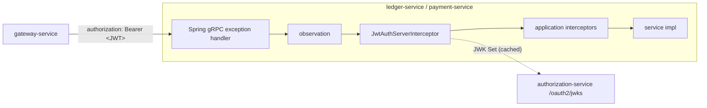

# grpc-jwt-auth-spring-boot-starter

Authenticates every incoming gRPC call on a Spring gRPC server with a short-lived internal JWT, and hands the verified
caller to service code. Built for the internal hop of a phantom-token architecture: external clients hold opaque,
DPoP-bound tokens; the gateway resolves them at the edge and forwards a signed, single-audience JWT to the service it
calls. This starter is what the called service uses to check that JWT.

Consumed by `ledger-service` and `payment-service` (wired in the gateway PR). Java 25, Spring Boot 4.0, Spring gRPC 1.0,
Nimbus JOSE + JWT 10.4.

## How it works



For each call, `JwtAuthServerInterceptor`:

1. lets methods listed in `grpc.auth.public-methods` through without a token (default: gRPC health only);
2. requires exactly one `authorization` header with a `Bearer` token (scheme case-insensitive);
3. verifies the token (see [What is verified](#what-is-verified));
4. on success, removes the `authorization` header and attaches an `AuthenticatedPrincipal` to the call's gRPC
   `Context`; on failure, closes the call with a generic status before it reaches the service.

The failure reason is logged at WARN on the server and never sent to the caller.

## What is verified

| Check | Rule |
|---|---|
| `typ` header | `at+jwt` (RFC 9068), or the equivalent `application/at+jwt` |
| Algorithm | allowlisted asymmetric algorithms only (default `PS256`); `none` and HMAC can't be configured |
| Signature | against a key from the authorization server's JWK Set, selected by `kid` |
| `iss` | exact match |
| `aud` | contains this service's identifier |
| Required claims | `sub`, `exp`, `iat`, `jti` |
| `exp` / `nbf` | with clock skew |
| `iat` | not in the future, and not older than `max-token-age` (with clock skew), whatever `exp` says |
| `scope` | parsed as a space-delimited string (RFC 9068) or a JSON array (Spring Authorization Server) |

This is stricter than Spring Security's `NimbusJwtDecoder` defaults, which only check `exp`/`nbf` and, when configured,
`iss`.

## Usage

Add the starter next to a Spring gRPC server starter (the starter itself doesn't bring a server):

```xml
<dependency>
    <groupId>org.example</groupId>
    <artifactId>grpc-jwt-auth-spring-boot-starter</artifactId>
    <version>0.0.1-SNAPSHOT</version>
</dependency>
```

Configure the three required properties; the service fails to start without them:

```yaml
grpc:
  auth:
    issuer: http://localhost:9000
    audience: ledger-service
    jwks-uri: http://localhost:9000/oauth2/jwks
```

Read the caller in service code:

```java
@Override
public void getBalance(GetBalanceRequest request, StreamObserver<GetBalanceResponse> observer) {
    AuthenticatedPrincipal caller = GrpcAuthContext.requirePrincipal();
    caller.requireScope("ledger:read");
    UUID userId = UUID.fromString(caller.subject());
    // ...
}
```

- `GrpcAuthContext.requirePrincipal()` returns the caller, or fails the call with `UNAUTHENTICATED` (e.g. in a public
  method).
- `GrpcAuthContext.current()` returns an `Optional`, for code that serves both public and authenticated calls.
- `principal.requireScope(...)` fails the call with `PERMISSION_DENIED`; `hasScope(...)` just checks.

### Work on other threads

The principal lives in the gRPC `Context`, not a `ThreadLocal`, because grpc-java may run one call's callbacks on
different threads. Work handed to another thread only sees it when wrapped:

```java
executor.submit(Context.current().wrap(() -> audit(GrpcAuthContext.requirePrincipal())));
// or: Context.currentContextExecutor(executor)
```

## Status codes

| Situation | Status | Description sent to caller |
|---|---|---|
| Missing, malformed, duplicate or invalid token | `UNAUTHENTICATED` | `Invalid or missing credentials` |
| JWK Set unreachable and nothing usable cached | `UNAVAILABLE` (retryable) | `Authentication temporarily unavailable` |
| `requireScope` for a scope not granted | `PERMISSION_DENIED` | `Insufficient scope` |
| `requirePrincipal` where there is no caller | `UNAUTHENTICATED` | `Invalid or missing credentials` |

Every caller is the gateway holding a fresh token, so a downstream `UNAUTHENTICATED` means a gateway-side problem; the
gateway maps it to `502`, not `401`.

## Configuration

All properties are under `grpc.auth`. Invalid combinations fail at startup with a message naming the property; there
is no allow-all fallback.

| Property | Default | Notes |
|---|---|---|
| `enabled` | `true` | `false` registers nothing: calls are not authenticated |
| `issuer` | — (required) | expected `iss`, exact match |
| `audience` | — (required) | this service's identifier, must be in `aud` |
| `jwks-uri` | — (required) | absolute `http(s)` URI of the JWK Set |
| `algorithms` | `PS256` | asymmetric JWS algorithms only |
| `token-type` | `at+jwt` | required `typ` header |
| `clock-skew` | `30s` | applied to `exp`, `nbf` and `iat` |
| `max-token-age` | `5m` | `iat`-based age limit; must exceed `clock-skew`. Internal tokens live ~60s, so this only catches a misconfigured issuer |
| `public-methods` | `grpc.health.v1.Health/*` | `package.Service/*` or `package.Service/Method` |
| `jwks.cache-ttl` | `5m` | how long a fetched JWK Set is served from cache |
| `jwks.refresh-ahead` | `30s` | background refresh before expiry; `refresh-ahead + 2 × (connect-timeout + read-timeout)` must fit in `cache-ttl` |
| `jwks.outage-tolerance` | `1h` | how long the last JWK Set keeps being used while the endpoint is down |
| `jwks.rate-limit` | `30s` | window in which at most one further fetch is allowed; must be shorter than `cache-ttl` |
| `jwks.connect-timeout` | `500ms` | |
| `jwks.read-timeout` | `1s` | |

gRPC server reflection is deliberately not public by default: it exposes the full API schema. Add
`grpc.reflection.v1.ServerReflection/*` to `public-methods` to open it.

### JWK Set behaviour

- **Lazy:** nothing is fetched until the first token arrives, so a service can start before the authorization server.
  That first call blocks on the fetch, on the gRPC application executor (not a transport thread).
- **Key rotation:** a token whose `kid` isn't cached triggers a refetch, rate-limited so a stream of made-up `kid`s
  doesn't become a stream of JWKS requests.
- **Outages:** the last fetched set is served for `outage-tolerance`; after that, calls get `UNAVAILABLE`, never a
  pass.

## Customizing

Every bean backs off when the application defines its own of the same type:

| Bean | Override to |
|---|---|
| `JwtTokenVerifier` | use a different key source (the starter's own JWK Set bean then isn't created) |
| `JwtAuthServerInterceptor` | change how calls are authenticated |
| `GrpcAuthExceptionHandler` | change how authorization failures map to statuses |

The starter's `JWKSource` bean is not a default injection candidate, so it neither replaces nor clashes with a
`JWKSource` the application has for other purposes. The interceptor runs at order
`GrpcJwtAuthAutoConfiguration.INTERCEPTOR_ORDER` (100): inside Spring gRPC's exception handler (`HIGHEST_PRECEDENCE`)
and observation (0) interceptors, so rejected calls still get status mapping, metrics and traces, and before
application interceptors with the default order, which can read `GrpcAuthContext`.

## Pitfalls

- **Don't disable Spring gRPC's exception handler** (`spring.grpc.server.exception-handler.enabled=false`). Plain
  grpc-java turns any exception thrown from a service method into `UNKNOWN`, so `requireScope` and `requirePrincipal`
  failures would lose their status. The starter registers a `GrpcExceptionHandler` bean so that Spring gRPC's handler
  interceptor is active.
- **Don't combine with Spring Security's gRPC auto-configuration.** Both would authenticate the same calls, with
  different rules. Use one.
- **Public methods have no caller.** `requirePrincipal()` in a method listed in `public-methods` always fails.

## Threat model

Internal calls are authenticated at three layers: the JWT (this starter), transport security between services (mTLS,
planned for the deployment profile, not yet built; dev traffic is plaintext), and application-level idempotency in
payment-service. The table says which layer stops which attacker.

| Attacker / failure | Stopped by | Notes |
|---|---|---|
| Forges a token without the signing key | Starter: signature + algorithm allowlist | `none` and HMAC can't be configured, which rules out algorithm-confusion attacks |
| Replays a token meant for another service (e.g. a ledger token against payment) | Starter: single `aud` | the gateway requests one audience per call |
| Presents another kind of JWT from the same issuer (ID token, token for another purpose) | Starter: `typ: at+jwt` + exact `iss` | |
| Calls a service directly, bypassing the gateway, with no token | Starter: default-deny | only `public-methods` skip authentication |
| Steals a token in transit on the internal network | mTLS (planned) | until then, a stolen token is usable for its remaining lifetime |
| Replays a stolen token | Short lifetime (~60s) + `iat` age limit | bounds the window; doesn't close it, see single-use tokens below |
| Replays a write byte for byte | payment-service idempotency key | only covers byte-exact replays; an attacker who can change the request has a token-theft problem, not an idempotency problem |
| Floods made-up `kid`s to trigger JWKS fetches | Starter: rate-limited refetch | |
| Authorization server outage | Starter: cached keys for `outage-tolerance` | afterwards `UNAVAILABLE`, never allow-all |
| Misconfiguration (missing issuer or audience, weak algorithm) | Starter: startup failure | |
| Token leaks through service logs | Starter strips the `authorization` header | failure reasons are logged server-side only, never returned |
| Compromised gateway | **Partly**: token design bounds it; payment content is not covered by this starter | the gateway relays identities but can't mint them (authorization-service signs every token), so the blast radius is the users active during the compromise, for their token lifetimes. It can still alter what those users submit; binding payment content (RAR dynamic linking, client-signed payment intents) is planned in the gateway PR |

### Rejected designs

- **Single-use internal tokens (consuming `jti` per request).** The gateway caches resolved tokens, so a `jti` repeats
  across requests; single use would need a gateway-signed per-request proof (an internal DPoP) and a Redis `jti` set in
  every service. The only threat it uniquely covers, sniffing or injecting on plaintext internal traffic, is mTLS's job.
- **Signed request envelopes on gRPC** (gateway signs payload, nonce, timestamp and method; the service verifies and
  keeps a nonce cache). A sound mechanism in the AWS SigV4 / RFC 9421 family, but on this hop it duplicates mTLS
  (confidentiality, integrity, replay protection, peer authentication) at the cost of a per-request signature, a
  per-request Redis write, gateway key management, and signing non-canonical protobuf bytes. Message-level signing
  belongs on Kafka, where messages sit in brokers outside any TLS session; that is a separate starter.
- **Spring Security (`GrpcSecurity` + `NimbusJwtDecoder`).** Same Nimbus primitives underneath, but the default
  validation is weaker (see above) and it brings the servlet-era `SecurityContextHolder` (a `ThreadLocal`) into gRPC.
  Not replicated on purpose: `@PreAuthorize`, authentication events, authority mapping. Per-method authorization
  annotations can come later, once real scopes exist.

## Development

```bash
mvn -pl auth-starter verify
```

Runs the unit and integration tests (JaCoCo gate at 80% instruction coverage). The tests use generated RSA keys, a JDK
`HttpServer` as the JWKS endpoint, an in-process gRPC server with hand-built String methods (no generated stubs), and
`ApplicationContextRunner` against Spring gRPC's real auto-configurations.
